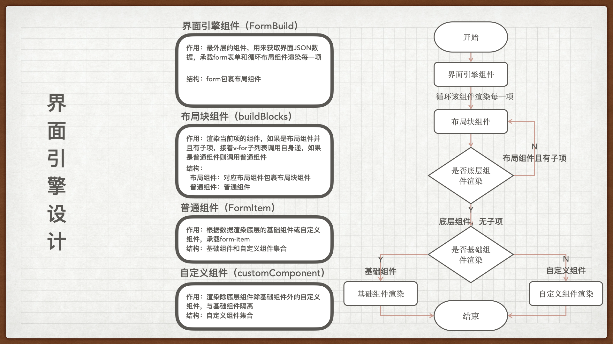

<!--
 * @Author: ZZH
 * @Date: 2021-07-30 09:25:12
 * @LastEditTime: 2021-07-30 09:41:18
 * @LastEditors: ZZH
 * @Description: 界面引擎文档
 * @FilePath: /vuepress-starter/docs/soundCode/build.md
-->
# build界面引擎

## 原理

通过JSON数据递归渲染界面

